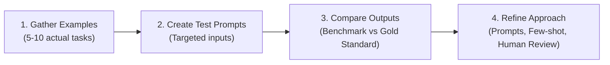
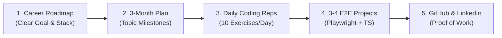

# 🧠 Prompt Engineering & LLM Practical Notes

---

## 📌 1. Good Prompt Example: Production-Ready QA Test Plan

### 🎯 Prompt
> "I want you to act as someone with **15 years of experience** who has very deep functional knowledge of QA. 
> 
> I want you to create a comprehensive, **production-ready test plan** for the website `app.thetestingacademy.com`.
> 
> In this case, I want you to research the website domain, determine what a real-world test plan looks like, and establish the proper structure. 
> 
> **Output Format:** Create the test plan in the **Jira / Zephyr format** ready to be directly uploaded into Zephyr."

---

## 🏗️ 2. The 3-Element Prompt Framework (Stage, Task, Rules)

### 💡 Example Prompt
> *"I'm a backend developer at a fintech startup building a transaction monitoring service. We're evaluating whether to go serverless (AWS Lambda) or containerized (ECS/Fargate) for our new fraud detection microservice, which processes around 500 events per second at peak. Can you compare both approaches across cost, scalability, cold start latency, and operational overhead? Structure it as a comparison table followed by a recommendation with reasoning."*

### 🔍 Framework Breakdown

| Element | Description | Example Application |
| :--- | :--- | :--- |
| **🎭 Stage (Context / Role)** | Who you are, domain, constraints, and scale | Backend dev, fintech startup, fraud detection microservice, ~500 events/sec peak load |
| **🎯 Task** | Specific objective to achieve | Compare AWS Lambda vs ECS/Fargate across 4 specific dimensions (cost, scale, cold start, ops overhead) |
| **📐 Rules (Format / Constraints)** | Structure, tone, boundaries, and formatting | Comparison table + written recommendation with technical but concise tone |

---

## 📎 3. Adding Context to Claude & Multimodal LLMs

Uploads are a shortcut — instead of typing lengthy background descriptions, attach the raw source files directly.

### 📄 Supported File Types
* **Text & Data:** `PDF`, `DOCX`, `CSV`, `TXT`
* **Visual Elements:** `PNG`, `JPEG` (charts, UI screenshots, architectural diagrams)

### 🚀 Common Context Workflows
* **Upload a Document** ➔ Ask LLM to summarize key points & risks.
* **Share an Image / Diagram** ➔ Ask LLM to describe, analyze, or transcribe OCR data.
* **Attach a Spreadsheet** ➔ Ask LLM to detect trends, anomalies, and metrics.
* **Upload Code Files** ➔ Ask LLM to explain architecture, refactor, or find edge-case bugs.

---

## 🔄 4. Iterating on Responses (Feedback Loops)

> [!TIP]
> **First drafts are starting points, not final answers.** Use active steering to refine outputs.

* **➕ Follow-up Questions:** *"Can you expand on the second point and add code examples?"*
* **🎨 Tone / Style Feedback:** *"This is good, but the tone is too formal. Make it concise and conversational."*
* **🎯 Redirect / Clarify:** *"Actually, I was asking about X, not Y. Let me clarify the boundary conditions..."*
* **🔁 Clean Restart:** Open a new chat with a refined prompt if the conversation drifts off-topic.

---

## 📊 5. 4-Step Evaluation Approach (Testing Task Feasibility)

How to systematically determine if an LLM is reliable for a specific recurring task:



1. **Gather Examples:** Collect 5–10 real-world examples of a task you perform regularly.
2. **Create Test Prompts:** Write prompt templates that generate similar outputs.
3. **Compare Outputs:** Run your prompts and benchmark the LLM's responses against your golden examples:
   - *Does the LLM capture the essential domain information?*
   - *Is the tone, depth, and structure appropriate?*
   - *What edge cases or details are missing?*
4. **Refine Your Approach:** Adjust system prompts, add few-shot examples, and identify where human review is mandatory.

---

## ⚡ 6. Automation Case Study: Hotfix Validator AI Agent

### 🛠️ Problem & Manual Workflow
```
Get Branch from Dev ➔ Deploy to Hotfix Env ➔ Run PO / Regression Suite ➔ Sign-in & Notify on Slack
```
* **Manual Time Spent:** ~1 to 2 hours per hotfix deployment.
* **Bottleneck:** Repetitive manual verification, environment sanity checks, and status reporting.

### 🤖 Solution: Custom AI Agent / Skill
* **Agent Role:** `hotfix-validator-aiagent`
* **Automation:** Triggers hotfix verification pipeline, parses logs, validates critical paths, and formats Slack sign-off summaries.
* **ROI:** Saves **1–2 hours per day** of manual QA/Dev time.

---

## 🚀 7. Manual QA to Test Automation Transition Formula

### 📋 Overview
A structured roadmap designed to eliminate coding fear and build production-grade automation skills through consistent daily repetitions and public proof of work.



### 🛣️ The 5-Step Transition Framework

1. **Clear Career Roadmap:** Define the exact target tech stack (e.g., *TypeScript + Playwright* or *Python + pytest*).
2. **3-Month Milestone Plan:** Commit to a 100% structured curriculum for 90 days with weekly milestones.
3. **Dedicated Daily Time Allocation:** Commit at least **1 hour daily** to language fundamentals and test automation libraries.
4. **Volume of Coding Repetitions:**
   - **Language Fundamentals:** Complete **250–300 exercises** (~10 daily coding katas) in JavaScript/TypeScript.
   - **Framework Creation:** Build **3–4 end-to-end production-ready frameworks** (Page Object Model, API mocks, parallel execution, CI/CD integration).
   - **Total Practice Volume:** Target **300–400 total exercises** to overcome coding fear and establish muscle memory.
5. **Public Proof of Work & Personal Brand:**
   - Push all clean framework code and test suites to public **GitHub** repositories.
   - Share weekly learning milestones, project architectures, and solutions on **LinkedIn** to build credibility.

> [!TIP]
> **Overcoming the "Coding Fear":** The fastest way to overcome imposter syndrome in automation is progressive volume. 10 simple exercises daily over 30 days builds more practical confidence than passive tutorial watching.

---

## ✍️ 8. Personal Brand Voice & Content Creation Framework (Hook, Story, Offer)

### 🎯 Objective
A prompt framework to train LLMs to generate high-engagement thought leadership content on **LinkedIn** and **Medium** representing a **16+ Years Experience QA Lead / Founder**.

### 📐 The "Hook, Story, Offer" Structure

| Component | Purpose | Key Focus |
| :--- | :--- | :--- |
| **🪝 Hook** | Stop the scroll in the first 2 lines | Bold opinion, counter-intuitive insight, or relatable QA pain point |
| **📖 Story** | Build trust and provide deep value | 16+ years of real-world SDET experience, project wins/failures, and practical lessons |
| **🎁 Offer / CTA** | Drive reader action | Actionable takeaway, checklist, resource download, or discussion question |

### 💡 Meta-Prompt: Training the LLM on Your Brand Voice

```markdown
> "You are an expert ghostwriter and personal branding strategist specializing in software engineering, QA, and SDET thought leadership.
>
> I have 16+ years of experience in Software Quality Assurance, test architecture, and tech leadership (Founder of Testing Academy).
>
> **Your Task:**
> 1. Analyze my background, resume, and experience to establish a distinct, authoritative, and relatable brand voice.
> 2. Generate LinkedIn and Medium articles following the 'Hook, Story, Offer' framework.
> 3. Tone: Pragmatic, experienced, encouraging to beginners, but deeply technical and no-BS for senior peers.
> 4. Avoid generic AI fluff, buzzwords, or superficial advice. Use concrete numbers, real-world architecture examples, and actionable steps."
```


